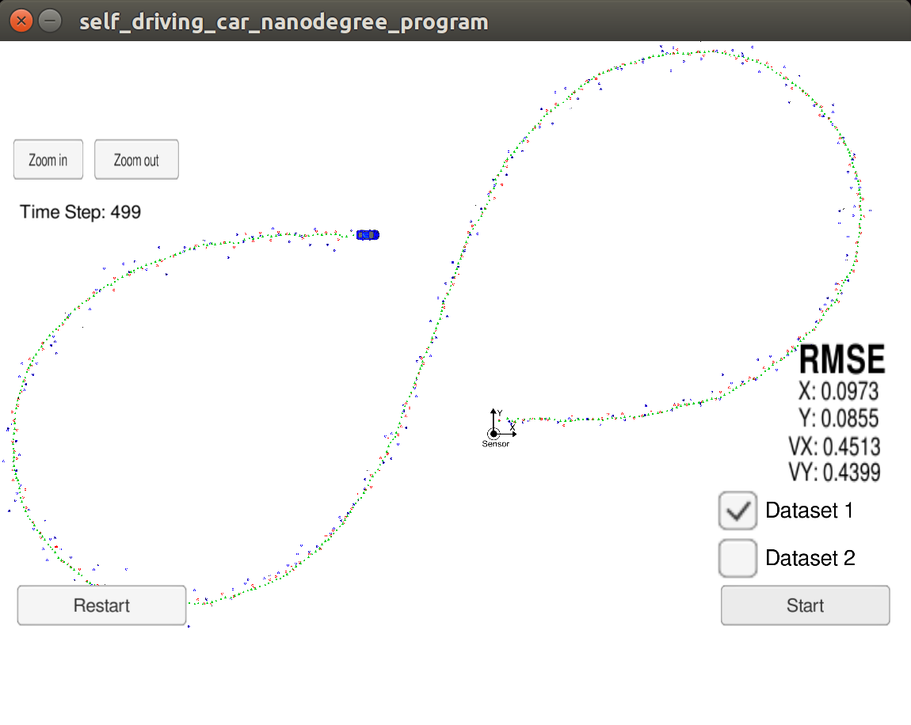
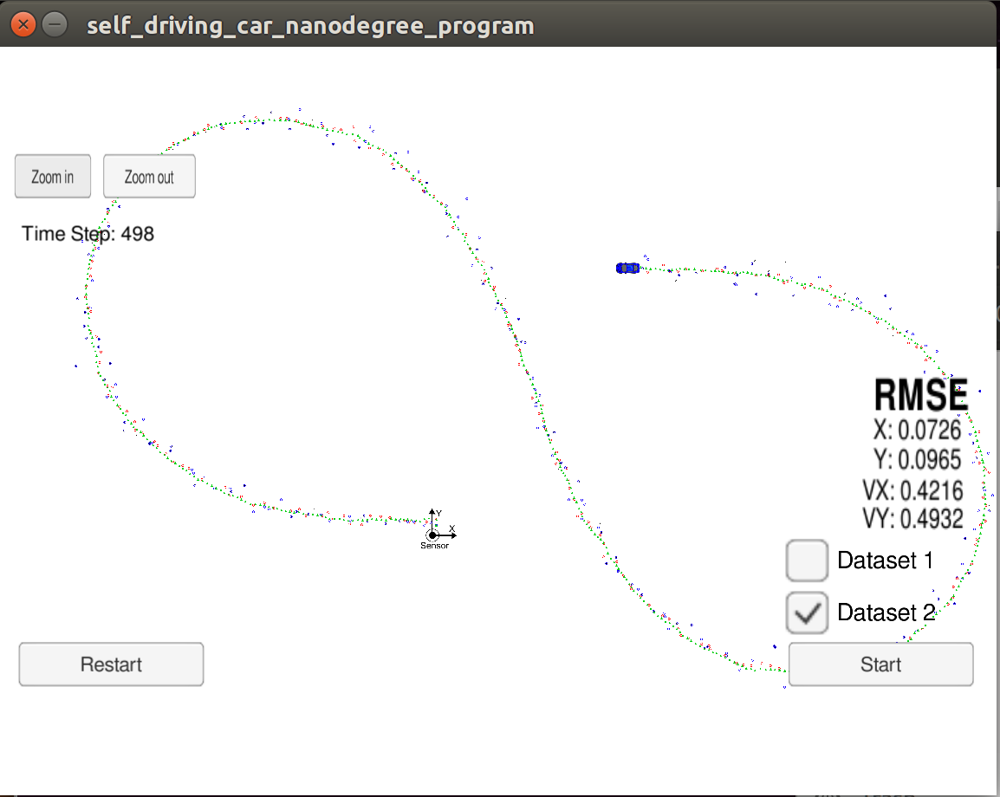

# Extended Kalman Filter Project
Self-Driving Car Engineer Nanodegree Program

In this project you will utilize a kalman filter to estimate the state of a moving object of interest with noisy lidar and radar measurements. Passing the project requires obtaining RMSE values that are lower than the tolerance outlined in the project rubric. 

This project involves the Term 2 Simulator which can be downloaded [here](https://github.com/udacity/self-driving-car-sim/releases)

This repository includes two files that can be used to set up and install [uWebSocketIO](https://github.com/uWebSockets/uWebSockets) for either Linux or Mac systems. For windows you can use either Docker, VMware, or even [Windows 10 Bash on Ubuntu](https://www.howtogeek.com/249966/how-to-install-and-use-the-linux-bash-shell-on-windows-10/) to install uWebSocketIO. Please see [this concept in the classroom](https://classroom.udacity.com/nanodegrees/nd013/parts/40f38239-66b6-46ec-ae68-03afd8a601c8/modules/0949fca6-b379-42af-a919-ee50aa304e6a/lessons/f758c44c-5e40-4e01-93b5-1a82aa4e044f/concepts/16cf4a78-4fc7-49e1-8621-3450ca938b77) for the required version and installation scripts.

Once the install for uWebSocketIO is complete, the main program can be built and run by doing the following from the project top directory.

1. mkdir build
2. cd build
3. cmake ..
4. make
5. ./ExtendedKF


# Steps to accomplish the project

To make the starter code running, a few parts of the program needed to be completed:
* initialize variables and matrices (x, F, H_laser, H_jacobian, P, etc.)
* initialize the Kalman filter position vector with the first sensor measurements
modify the F and Q matrices prior to the prediction step based on the elapsed time between measurements
* call the update step for either the lidar or radar sensor measurement. Because the update step for lidar and radar are slightly different, there are different functions for updating lidar and radar.

Most of the code could be just directly used from the lessons quizzes, but some needed to be written and tested including:
* based on the first measurement init state vector ''x'' (where polar coordinates needed to be converted to cartesian coordinates):
```
float ro = measurement_pack.raw_measurements_(0);
float teta = measurement_pack.raw_measurements_(1);
ekf_.x_(0) = ro * cos(teta);
ekf_.x_(1) = ro * sin(teta);
```
* call update function with appropriate matrices (laser and ladar have different sizes of R and H matrices):
```
if (measurement_pack.sensor_type_ == MeasurementPackage::RADAR) {
cout<<"Radar:"<<endl;

// Radar updates
Hj_ = tools.CalculateJacobian(ekf_.x_);

ekf_.H_ = Hj_;
ekf_.R_ = R_radar_;
ekf_.UpdateEKF(measurement_pack.raw_measurements_);

} else {
cout<<"Lidar:"<<endl;
// Laser updates
ekf_.H_ = H_laser_;
ekf_.R_ = R_laser_;
ekf_.Update(measurement_pack.raw_measurements_);
  }
```
* prepare Extended Filter Update step function, where before caclulation vector ''y'' (the difference between predicted and measured position), the cartesian coordinates needed to be converted to polar coordinates:
```
float rho = sqrt(x_(0)*x_(0) + x_(1)*x_(1));
float phi = atan2(x_(1), x_(0));
//divide by zero protection
float rho_dot;
if (fabs(rho) < 0.0001) {
rho_dot = 0;
} else {
rho_dot = (x_(0)*x_(2) + x_(1)*x_(3))/rho;
}
VectorXd z_pred(3);
z_pred << rho, phi, rho_dot;
```
* ensure the calculated ``theta`` angle was inside the interval [-π , +π] in each update step
```
while (y(1) > M_PI) {
y(1) -= 2 * M_PI;
}
while (y(1) < -M_PI) {
y(1) += 2 * M_PI;
}
```
# Results
As a result, the following RMSE values where achived:
* for dataset 1: (0.0973, 0.855, 0.4513, 0.4399)
* for dataset 2: (0.0973, 0.855, 0.4513, 0.4399)



